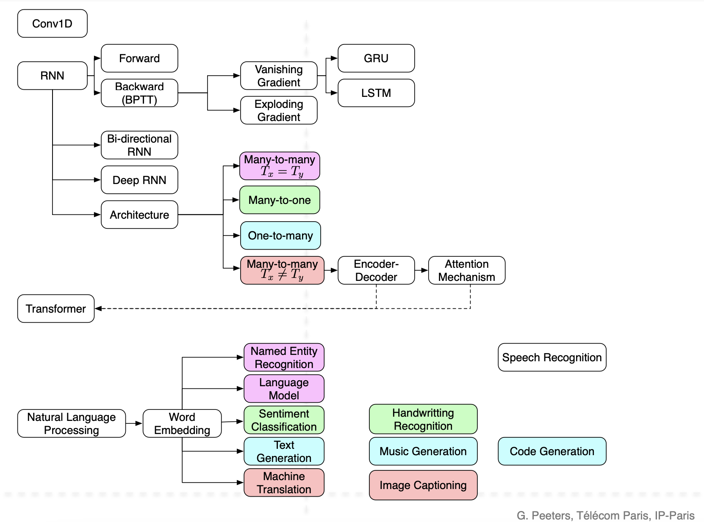

# Deep Learning Course

Prof. Geoffroy Peeters, LTCI S2A, Télécom Paris

**Overview diagram** 😊

## Lab 1: Multi-Layer Perceptron (MLP)

This lab consists of two parts where we explore the implementation of a Multi-Layer Perceptron (MLP) for classification problems. We first build an MLP from scratch using `numpy` and then move on to different approaches using `pytorch`.

### Part One: MLP Implementation with Numpy
📖 **Notebook**: [DL_MLP_fromscratch.ipynb](./lab1/DL_MLP_fromscratch.ipynb)

In this part, we manually implement a two-layer MLP with one hidden layer using only `numpy`. 

Key Concepts Covered: Forward Propagation, Backward Propagation, Loss Calculation, Manual Weight Updates.

---

### Part Two: MLP Implementation with PyTorch
📖 **Notebook**: [DL_MLP_pytorch.ipynb](./lab1/DL_MLP_pytorch.ipynb)

In this part, we develop a MLP with two hidden layers using `pytorch` and experiment with three different approaches for binary classification.

### Three Models Implemented:
- **Model A**: Manual parameter definition (W1, b1, W2, b2, W3, b3), forward propagation equations, backpropagation, and update the weights using the gradients.
- **Model B**: Implementation using `torch.nn.Sequential`.
- **Model C**: A custom class inheriting from `torch.nn.Module`, where the forward method is explicitly defined.

Key Concepts Covered: PyTorch tensors, PyTorch’s automatic differentiation, custom neural network architectures

## Lab 2: Recurrent Neural Networks

### Part One: RNN Many-To-One problem with Keras
📖 **Notebook**: [DL_RNN_CLASS_keras.ipynb](./lab2/DL_RNN_CLASS_keras.ipynb)

In this lab, we implement two neural networks to automatically rate movies based on text reviews. We utilize the IMDb dataset, which provides reviews in the form of indexes that correspond to a pre-defined word dictionary. Each word in the reviews is encoded as an index. Our goal is to develop models that predict a binary rating (0 or 1) for each movie based on its review text.

Key Concepts Covered: RNN, keras, Text Encoding and Indexing

### Part Two: One-To-Many problem using LSTM and Transformer-Decoder 
📖 **Notebook**: [DL_Transformer_GEN.ipynb](./lab2/DL_Transformer_GEN.ipynb)

🎶 In this lab, we are training a neural network language model to learn the musical language of Johann Sebastian Bach, focusing on his "Cello Suites." Instead of using traditional text, we utilize MIDI files, which encode musical notes, durations, and intensities. After training the model on the complete set of "Cello Suite" MIDI files, we sample it to generate a new MIDI file, resulting in an original composition inspired by Bach's style.

Key Concepts Covered: RNN, Neural Networks for Music Generation, keras

